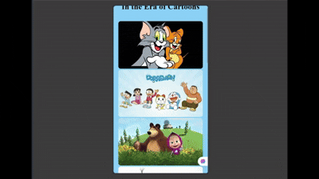

# 🍽️ Zomato Homepage Clone

A frontend clone of Zomato's homepage built using **HTML5** and **CSS3** — no frameworks, no libraries (aside from Font Awesome icons).

---

## ✨ Features
- Functional search bar UI
- Filter, Pure Veg, and Cuisine selector buttons
- "Inspiration for your first order" cuisine cards with hover animations
- Custom fonts via `@font-face`

---

## 🛠️ Built With
- HTML5
- CSS3 (Flexbox)
- Font Awesome Icons

---

## 🔗 Live

https://zomato-homepage-clone.vercel.app/

---

## 📸 Preview

---

## 📚 What I Learned
- Structuring flex-based navbars
- Working with custom fonts and icon dropdowns
- Building interactive hover states with pure CSS

---

## 🔗 Connect
Feel free to fork, star ⭐, or reach out with feedback!
