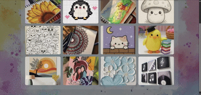

# 🖼️ Image Gallery with Lightbox

**Day 5 / 100 — #100Days100Projects Challenge**

A responsive image gallery with a fully interactive lightbox — click any image to view it full-screen, navigate with arrows or your keyboard, and enjoy a soft glassmorphism UI over a custom background. Built with plain **HTML, CSS, and JavaScript** — no frameworks, no libraries.

---

## ✨ Features

- 🔳 Responsive grid gallery (auto-adjusts to any screen size)
- 💡 Click-to-open lightbox with a smooth fade-in animation
- ⬅️➡️ Next / Previous navigation via buttons **or** arrow keys
- ⌨️ Keyboard shortcuts — `←` `→` to navigate, `Esc` to close
- 🖱️ Click outside the image to close the lightbox
- 🔢 Live image counter (e.g. `3 / 12`)
- 🌫️ Custom background image with a frosted-glass overlay effect
- 📱 Fully responsive — works on mobile, tablet, and desktop

---

### 📸 Preview

---

### 🚀 Live Demo

🔗 Live Website: https://pixel-and-palette.vercel.app/

---

## 🛠️ Tech Stack

| Layer | Tech |
|-------|------|
| Structure | HTML5 |
| Styling | CSS3 (Grid, Flexbox, `backdrop-filter`, animations) |
| Interactivity | Vanilla JavaScript (DOM manipulation, event listeners) |

No frameworks. No build tools. Just the fundamentals — done well.

---

## 📬 Connect

If you're following the **#100Days100Projects** journey, feel free to connect, fork this repo, or drop feedback!

⭐ **Star this repo** if you found it useful.
