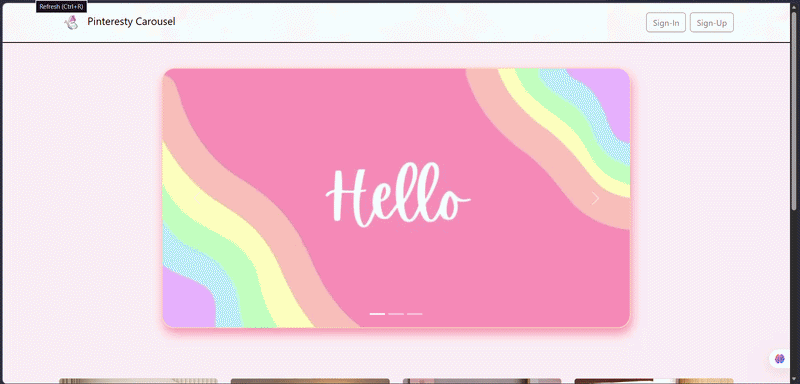

# 🧡 Pinteresty Product Carousel — Day 7/100

A responsive, Pinterest-inspired product showcase page built with **Bootstrap 5**, featuring a sleek navbar, an interactive image carousel, product cards, and functional Sign In / Sign Up modals — part of my **#100DaysOfCode** challenge.

---

## 🔗 Live Demo

👉 **[View Live Site](https://pinteresty-carousel.vercel.app/)**

---

## ✨ Features

- 🖼️ **Hero Carousel** — auto-sliding image carousel with custom indicators & controls
- 🃏 **Product Cards** — Pinterest-style masonry/grid cards with hover effects
- 🧭 **Responsive Navbar** — collapsible navigation for mobile & desktop
- 🔐 **Sign In / Sign Up** — modal-based auth forms with validation-ready markup
- 📱 **Fully Responsive** — mobile-first layout using Bootstrap's grid system

---

## 🛠️ Tech Stack

| Technology | Purpose |
|---|---|
| HTML5 | Structure |
| CSS3 | Custom styling & animations |
| Bootstrap 5 | Responsive components & grid |
| JavaScript | Carousel & modal interactivity |

---

## 📸 Preview

---

⭐ If you liked this project, consider giving it a star — it motivates me to keep building!
